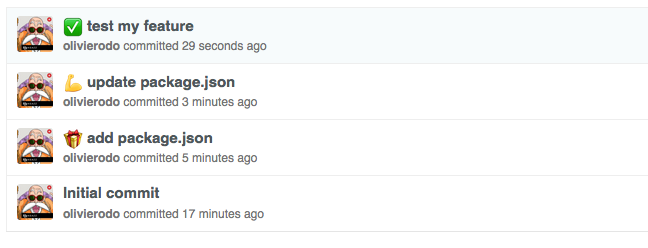
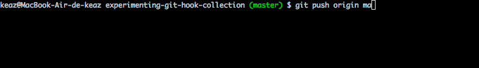

[](https://travis-ci.org/olivierodo/git-hook-collection)

# GIT-HOOK-COLLECTION (work in progress)

Collection of various git hooks ready to use for nodeJS.

Let's have fun with git hooks!

## Getting started

```
$ npm install git-hook-collection --save-dev
```

during the installation you have to choose what is the hook you wants to add.


## Emoji

Prefix your commit message with an emoji.



[More detail](doc/emoji.md)


## Test Buddy - before push your code

A nice buddy, who runs the test before let you push



> Your `npm test` command have to be configured

